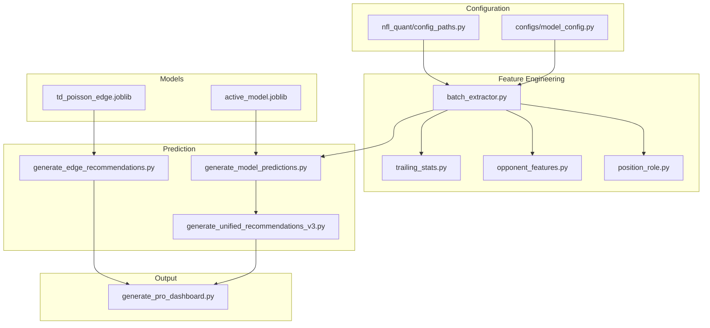

# Architecture Overview

**Version**: 1.0 | **Last Updated**: 2025-12-26 | **Model Version**: V28

---

## System Purpose

NFL QUANT converts raw NFL statistics into probability-weighted betting recommendations with positive expected value.

```
┌──────────────────────────────────────────────────────────────────────────────┐
│                                                                              │
│   NFLverse Data   →   Feature Engineering   →   ML Models   →   Picks       │
│   Odds API        →   (46 features)          →   XGBoost    →   Dashboard   │
│   Sleeper API     →                          →   Poisson    →               │
│                                                                              │
└──────────────────────────────────────────────────────────────────────────────┘
```

---

## Bounded Contexts

The system is organized into six bounded contexts, each with clear responsibilities:

### 1. Data Ingestion Context

**Purpose**: Fetch and store raw data from external sources.

**Components**:
- `scripts/fetch/fetch_nflverse_data.R` - R script for NFLverse
- `scripts/fetch/fetch_injuries_sleeper.py` - Sleeper API
- `scripts/fetch/fetch_live_odds.py` - Odds API
- `scripts/fetch/fetch_nfl_player_props.py` - Player props

**Data Flow**:
```
External APIs → Raw Parquet/CSV → data/nflverse/, data/odds/
```

**Key Decision**: R for NFLverse (nflreadr is faster than Python alternatives).

### 2. Feature Engineering Context

**Purpose**: Transform raw data into model-ready features.

**Components**:
- `nfl_quant/features/batch_extractor.py` - Main orchestrator
- `nfl_quant/features/trailing_stats.py` - EWMA trailing averages
- `nfl_quant/features/opponent_features.py` - Defense metrics
- `nfl_quant/features/position_role.py` - Position matchups

**Data Flow**:
```
Raw Parquet → Feature Extraction → 46-column Feature Matrix
```

**Key Decision**: Vectorized pandas operations for 100x performance.

### 3. Prediction Context

**Purpose**: Generate probability estimates using trained models.

**Components**:
- `data/models/active_model.joblib` - XGBoost classifiers
- `data/models/td_poisson_edge.joblib` - Poisson regressors
- `nfl_quant/edges/ensemble.py` - Edge combination logic

**Data Flow**:
```
Feature Matrix → Model Inference → P(UNDER) scores
```

**Key Decision**: Separate models for continuous stats (XGBoost) and TDs (Poisson).

### 4. Calibration Context

**Purpose**: Calibrate raw probabilities to true frequencies.

**Components**:
- `nfl_quant/calibration/platt_calibrator.py` - Platt scaling
- `nfl_quant/calibration/isotonic_calibrator.py` - Isotonic regression

**Data Flow**:
```
Raw P(UNDER) → Calibration → Calibrated Probability
```

**Key Decision**: 80/20 train/calibration split to prevent overfitting.

### 5. Betting Context

**Purpose**: Size bets and filter by signal-to-noise ratio.

**Components**:
- `nfl_quant/betting/kelly_criterion.py` - Kelly sizing
- `nfl_quant/betting/snr_filter.py` - Market-specific thresholds
- `configs/model_config.py::MARKET_FILTERS` - V27 game context filters

**Data Flow**:
```
Calibrated Probability → Edge Calculation → SNR Filter → Kelly Sizing → Units
```

**Key Decision**: Market-specific thresholds (receptions = high SNR, pass yards = low SNR).

### 6. Output Context

**Purpose**: Generate human-readable recommendations.

**Components**:
- `scripts/dashboard/generate_pro_dashboard.py` - HTML/JSON dashboard
- `scripts/predict/generate_unified_recommendations_v3.py` - CSV reports
- `deploy/web/` - Next.js web dashboard

**Data Flow**:
```
Sized Picks → Ranking → Dashboard/CSV/JSON
```

---

## Module Dependency Graph



---

## Data Flow Diagram

```
┌─────────────────────────────────────────────────────────────────────────────┐
│                              DATA SOURCES                                    │
├─────────────┬─────────────┬─────────────┬─────────────┬─────────────────────┤
│  NFLverse   │  Odds API   │  Sleeper    │  Manual     │                     │
│  (R)        │  (Python)   │  (Python)   │  Overrides  │                     │
└──────┬──────┴──────┬──────┴──────┬──────┴──────┬──────┴─────────────────────┘
       │             │             │             │
       ▼             ▼             ▼             ▼
┌─────────────────────────────────────────────────────────────────────────────┐
│                           data/nflverse/                                     │
│  pbp.parquet, depth_charts.parquet, player_stats.parquet, rosters.parquet   │
└─────────────────────────────────────────────────────────────────────────────┘
       │
       ▼
┌─────────────────────────────────────────────────────────────────────────────┐
│                        FEATURE EXTRACTION                                    │
│                      nfl_quant/features/                                     │
│                                                                              │
│  batch_extractor.py → 46 features per player-market-week                    │
└─────────────────────────────────────────────────────────────────────────────┘
       │
       ▼
┌─────────────────────────────────────────────────────────────────────────────┐
│                          MODEL INFERENCE                                     │
│                                                                              │
│  ┌────────────────────────────┐    ┌─────────────────────────────┐         │
│  │  XGBoost Classifiers       │    │  Poisson Regressors         │         │
│  │  (yards, rec, attempts)    │    │  (TD props)                 │         │
│  │  → P(UNDER)                │    │  → Expected TDs → P(OVER)   │         │
│  └────────────────────────────┘    └─────────────────────────────┘         │
└─────────────────────────────────────────────────────────────────────────────┘
       │
       ▼
┌─────────────────────────────────────────────────────────────────────────────┐
│                     EDGE & SIZING CALCULATION                                │
│                                                                              │
│  Edge = Model P(UNDER) - Implied P(UNDER from odds)                         │
│  Units = Kelly(Edge, Probability) capped at 2                               │
└─────────────────────────────────────────────────────────────────────────────┘
       │
       ▼
┌─────────────────────────────────────────────────────────────────────────────┐
│                            FILTERING                                         │
│                                                                              │
│  SNR Filter: Market-specific confidence thresholds                          │
│  Game Filter: Spread, bye week, snap share, position exclusions             │
└─────────────────────────────────────────────────────────────────────────────┘
       │
       ▼
┌─────────────────────────────────────────────────────────────────────────────┐
│                              OUTPUT                                          │
│                                                                              │
│  ┌──────────────┐  ┌──────────────┐  ┌──────────────┐                      │
│  │ HTML Dashboard│  │ JSON Picks   │  │ CSV Reports  │                      │
│  │ pro_dashboard │  │ picks.json   │  │ week*.csv    │                      │
│  └──────────────┘  └──────────────┘  └──────────────┘                      │
└─────────────────────────────────────────────────────────────────────────────┘
```

---

## External Integrations

### NFLverse (R)

**Endpoint**: GitHub releases via nflreadr
**Auth**: None
**Data**: Play-by-play, player stats, rosters, depth charts, snap counts
**Wrapper**: `scripts/fetch/fetch_nflverse_data.R`

### The Odds API

**Endpoint**: `https://api.the-odds-api.com/`
**Auth**: `ODDS_API_KEY` environment variable
**Data**: Live odds, player props
**Wrapper**: `scripts/fetch/fetch_live_odds.py`, `fetch_nfl_player_props.py`

### Sleeper API

**Endpoint**: `https://api.sleeper.app/`
**Auth**: None (public API)
**Data**: Injury reports
**Wrapper**: `scripts/fetch/fetch_injuries_sleeper.py`

---

## Architectural Constraints

1. **Batch Processing Only**: No real-time predictions. Daily/weekly batch runs.
2. **Python + R Hybrid**: R for data fetching, Python for ML.
3. **XGBoost for Classification**: Not regression. Predict P(UNDER), not actual stats.
4. **Poisson for TDs**: Count data requires appropriate distribution.
5. **Single-Model Versioning**: All markets use same feature set.

---

## Non-Goals

Things this system explicitly does NOT do:

- Real-time live betting
- Portfolio/bankroll management
- Fantasy football optimization
- Player comparison tools
- Historical stat lookups (beyond model needs)

---

## Further Reading

- [invariants.md](invariants.md) - Rules that must never be broken
- [../data/contracts.md](../data/contracts.md) - Data file schemas
- [../../ARCHITECTURE.md](../../ARCHITECTURE.md) - Full detailed architecture
